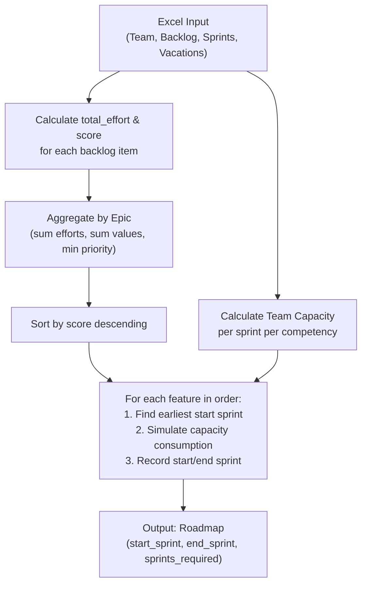

# Data Dictionary — Planning Tool

This document describes every column in the `planning_data.xlsx` workbook: what you need to fill in manually, and what the model computes automatically.

---

## 1. Excel Input Sheets (User-Filled)

### Sheet: **Team**

| Column | Type | Description |
|---|---|---|
| `person` | Text | Name of the team member. |
| `competency` | Select | One of: *Data Engineering*, *Data Science*, *Frontend*, *Business / PO*. |
| `hours_per_week` | Number | Total weekly working hours for this person. |
| `allocation_pct` | Number (0–100) | Percentage of their time allocated to this project. |

**How the model uses it:** Base capacity per sprint for each person is `hours_per_week × (allocation_pct / 100) × sprint_length_weeks`. These are aggregated per competency to form the available capacity each sprint.

---

### Sheet: **Backlog**

| Column | Type | Required? | Description |
|---|---|---|---|
| `feature_id` | Text | Yes | Unique identifier for the feature (e.g. `F-001`). |
| `feature_name` | Text | Yes | Descriptive name of the feature. |
| `priority` | Integer ≥ 1 | Yes | Priority ranking (**1 = most important**). Lower number → higher scheduling priority. See [How priority works](#how-priority-works). |
| `indicator` | Select | Yes | One of: *Conformidade*, *Aderência*, *Prontidão*, *Should Cost*. Groups features by strategic indicator. |
| `epic` | Text | No | Epic name. Features with the **same epic + indicator** are aggregated into a single scheduling unit (efforts summed, business values summed, min priority taken). Leave blank to schedule the feature individually. |
| `business_value` | Number | Yes | Estimated business value delivered by this feature. Higher = more valuable. |
| `effort_DE` | Number (hours) | Yes | Estimated effort in hours for **Data Engineering**. |
| `effort_DS` | Number (hours) | Yes | Estimated effort in hours for **Data Science**. |
| `effort_FE` | Number (hours) | Yes | Estimated effort in hours for **Frontend**. |
| `effort_PO` | Number (hours) | Yes | Estimated effort in hours for **Business / PO**. |
| `manual_start_sprint` | Integer ≥ 1 | No | Force this feature to start at a specific sprint. Leave blank for auto-scheduling. |

---

### Sheet: **Sprints**

| Column | Type | Description |
|---|---|---|
| `sprint` | Integer | Sprint number (1, 2, 3, …). |
| `start_date` | Date | Calendar start date of the sprint. |
| `end_date` | Date | Calendar end date of the sprint. |

**How the model uses it:** Maps sprint numbers to calendar dates so that vacation overlaps can be calculated accurately.

---

### Sheet: **Vacations**

| Column | Type | Description |
|---|---|---|
| `person` | Text | Name of the person (must match a name in the Team sheet). |
| `start_date` | Date | First day of vacation. |
| `end_date` | Date | Last day of vacation. |

**How the model uses it:** For each sprint, the model checks if a vacation overlaps the sprint's date range. If so, it proportionally deducts capacity: `hours_deducted = (days_off / sprint_total_days) × base_sprint_capacity`.

---

## 2. Computed Variables (Model-Generated)

These columns are **never** filled by the user. They are calculated at runtime.

### `total_effort`

| | |
|---|---|
| **Formula** | `effort_DE + effort_DS + effort_FE + effort_PO` |
| **Computed in** | [app.py, line 223](file:///c:/Users/Consultor%20Noorden/Desktop/planning-tool/app/app.py#L223) |
| **Purpose** | Represents the total hours needed across all competencies. Used as the denominator in the score formula. If the sum is 0, it is replaced with 1 to avoid division by zero. |

---

### `score`

| | |
|---|---|
| **Formula** | `(business_value / total_effort) × (1 / priority)` |
| **Computed in** | [app.py, line 225](file:///c:/Users/Consultor%20Noorden/Desktop/planning-tool/app/app.py#L225) |
| **Purpose** | The primary sorting key for scheduling. It combines a value-to-effort ratio with a priority weight. Higher score → scheduled earlier. |

#### How priority works

Priority is an integer starting from 1. It acts as a **penalty multiplier** on the value-to-effort ratio:

| Priority | Multiplier (`1/priority`) | Effect |
|---|---|---|
| 1 | 1.00 | Full score |
| 2 | 0.50 | Score halved |
| 3 | 0.33 | Score reduced to 1/3 |
| 5 | 0.20 | Score reduced to 1/5 |

A feature with `business_value=100`, `total_effort=50`, and `priority=1` gets `score = (100/50) × 1 = 2.0`.  
The same feature with `priority=3` gets `score = (100/50) × 0.33 = 0.67`.

---

### `sprints_required`

| | |
|---|---|
| **Formula** | `end_sprint − start_sprint + 1` |
| **Computed in** | [roadmap_engine.py, line 182](file:///c:/Users/Consultor%20Noorden/Desktop/planning-tool/app/roadmap_engine.py#L182) |
| **Purpose** | The actual number of sprints the feature occupies on the roadmap, accounting for parallel capacity sharing. This is the **real duration** after simulation, not a nominal estimate. |

> [!NOTE]
> A preliminary nominal estimate of sprints is also calculated in `calculate_feature_durations` (line 85), based on Sprint 1 capacity. However, the final `sprints_required` in the roadmap output is recalculated from the simulation results.

---

### `start_sprint`

| | |
|---|---|
| **Determination** | Either the `manual_start_sprint` value (if set), or the earliest sprint where all required competencies have remaining capacity > 0. |
| **Computed in** | [roadmap_engine.py, lines 167–172](file:///c:/Users/Consultor%20Noorden/Desktop/planning-tool/app/roadmap_engine.py#L167-L172) |
| **Purpose** | The sprint in which a feature begins execution. |

---

### `end_sprint`

| | |
|---|---|
| **Determination** | Result of the capacity-consumption simulation. The engine iterates sprint-by-sprint from `start_sprint`, consuming available capacity until all effort is consumed. |
| **Computed in** | [roadmap_engine.py, lines 174–175](file:///c:/Users/Consultor%20Noorden/Desktop/planning-tool/app/roadmap_engine.py#L174-L175) (calls `_simulate_feature`) |
| **Purpose** | The sprint in which a feature finishes execution. |

---

## 3. Scheduling Pipeline Summary

